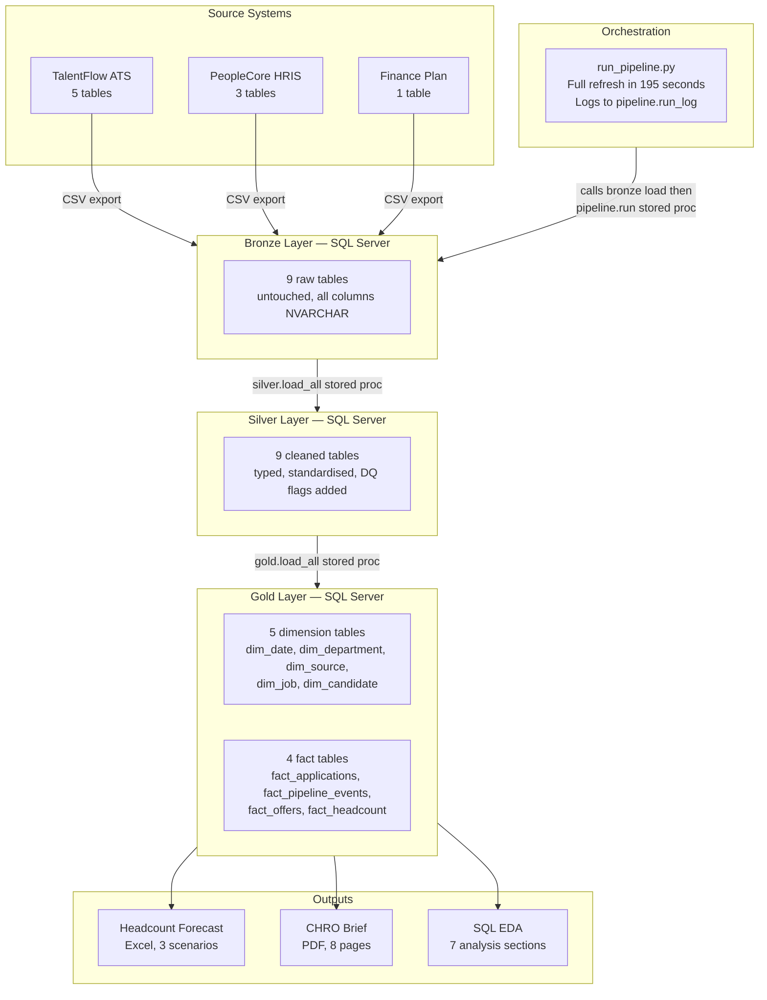

# Enova Technologies — Talent Intelligence Analytics


A end-to-end talent intelligence portfolio project built on synthetic data for a fictional gaming marketplace company. The project demonstrates the full analytics engineering stack: data generation, a three-layer SQL Server pipeline (bronze, silver, gold), automated orchestration, exploratory SQL analysis, a headcount forecast model, and an executive recommendations brief.

---

## Project Context

This project was built as a portfolio piece to demonstrate end-to-end talent intelligence capability. The fictional company, Enova Technologies, is a Series B gaming marketplace headquartered in Vilnius, growing from 50 to 300 employees over 18 months. The scenario was designed to be realistic: a company that implemented its first ATS mid-growth, with the data quality issues that typically come with that, and a hiring team under pressure to scale quickly against a board-approved headcount plan.

---

## Key Findings

Four findings were surfaced from the data through SQL-based exploratory analysis. Each finding is backed by a specific query against the gold layer.

| Finding | Headline number | Impact |
|---|---|---|
| Technical Assessment bottleneck | Technology averages 6.3 days vs 2.6 days for Data and Analytics | 41.8% of Technology assessments exceed 7 days |
| Referral programme gap | 26.3% conversion in Technology, 0 hires from referrals in 7 other departments | Referral hires score 4.18 avg performance vs 3.67 overall |
| Headcount plan off track | 37% below plan in Q1-Q2 2025, base case year-end at 322 vs 500 target | Zero departments hit their Q4 2024 target |
| HR attrition risk | 26.9% attrition in HR vs 10-11% company average | 4 of 7 HR departures have no recorded reason |

Full analysis is in `src/02_sql/19_analysis.sql`. Recommendations and evidence are in `outputs/chro_brief.pdf`.

---

## Architecture

The pipeline follows a medallion architecture with three layers in SQL Server. Python handles the initial load from CSV to bronze and the orchestration. All transformation and modelling logic lives in SQL.



### Data quality

18 data quality issues were documented before any cleaning code was written, covering inconsistent stage naming, mixed date formats, salary type errors, department name mismatches across systems, and missing termination reasons. Each issue has a documented cleaning rule and a flag column in the silver layer so downstream queries can filter or account for affected records.

The most significant issue: 40% of employees have no direct link to their ATS candidate record. A fuzzy name and date matching approach resolves roughly 60% of those cases, with the remainder tagged for exclusion from quality-of-hire metrics.

---

## Repository Structure

```
enova-talent-intelligence/
├── data/
│   └── raw/                          9 raw CSVs generated by the data generation notebook
│
├── src/
│   ├── 01_data_generation/
│   │   └── enova_data_generation.ipynb    Generates all synthetic data in Google Colab
│   │
│   ├── 02_sql/
│   │   ├── 01_load_bronze.py              Loads 9 CSVs into SQL Server bronze schema
│   │   ├── 02_silver_jobs.sql             Silver cleaning: talentflow_jobs
│   │   ├── 03_silver_candidates.sql       Silver cleaning: talentflow_candidates
│   │   ├── 04_silver_applications.sql     Silver cleaning: talentflow_applications
│   │   ├── 05_silver_pipeline_events.sql  Silver cleaning: pipeline events + DQ flags
│   │   ├── 06_silver_offers.sql           Silver cleaning: offers + amount parsing
│   │   ├── 07_silver_employees.sql        Silver cleaning: employees + salary fix
│   │   ├── 08_silver_performance.sql      Silver cleaning: performance reviews
│   │   ├── 09_silver_compensation.sql     Silver cleaning: compensation changes
│   │   ├── 10_silver_headcount_plan.sql   Silver cleaning: finance headcount plan
│   │   ├── 11_gold_dimensions.sql         Gold: dim_date, dim_department, dim_source,
│   │   │                                        dim_job, dim_candidate
│   │   ├── 12_gold_fact_applications.sql  Gold: fact_applications with TTH and QoH
│   │   ├── 13_gold_fact_pipeline_events.sql Gold: fact_pipeline_events with days_in_stage
│   │   ├── 14_gold_fact_offers.sql        Gold: fact_offers
│   │   ├── 15_gold_fact_headcount.sql     Gold: fact_headcount with variance
│   │   ├── 16_proc_silver_load_all.sql    Stored procedure: silver.load_all
│   │   ├── 17_proc_gold_load_all.sql      Stored procedure: gold.load_all
│   │   ├── 18_proc_pipeline_run.sql       Stored procedure: pipeline.run with logging
│   │   ├── 19_analysis.sql                EDA: 7 analytical sections, findings evidence
│   │   └── run_pipeline.py                Orchestration script: full refresh end to end
│   │
│   └── 03_analysis/
│       ├── headcount_forecast.py          Forecast model: 3 scenarios, Excel output
│       └── generate_chro_brief.py         Generates the CHRO PDF brief via reportlab
│
│
├── outputs/
│   ├── headcount_forecast.xlsx            Forecast: base, optimistic, pessimistic
│   └── chro_brief.pdf                     CHRO recommendations brief
│
└── docs/
    └── step1_foundations.md               Data dictionary, DQ issue log, stage definitions
```

---

## How to Run

### Prerequisites

- SQL Server with a database named `enova_talent`
- Python 3.10+ with `pandas`, `sqlalchemy`, `pyodbc`, `openpyxl`, `reportlab`, `python-dateutil`
- Google Colab account (for data generation)
- ODBC Driver 17 for SQL Server

### Step 1: Generate the raw data

Open `src/01_data_generation/enova_data_generation.ipynb` in Google Colab and run all cells. The notebook mounts Google Drive and saves 9 CSV files to `data/raw/`.

### Step 2: Load bronze

```bash
python src/02_sql/01_load_bronze.py
```

Connects to SQL Server and loads all 9 CSVs into the `bronze` schema. Runs in under 60 seconds.

### Step 3: Build silver and gold

Run the silver and gold SQL scripts in SSMS in order (02 through 15), then create the stored procedures (16 through 18).

Or run the full pipeline in one go:

```bash
python src/02_sql/run_pipeline.py
```

This loads bronze, then calls `pipeline.run` which executes `silver.load_all` and `gold.load_all` in sequence and logs the result to `pipeline.run_log`. Full refresh takes approximately 195 seconds.

### Step 4: Run the analysis

Open `src/02_sql/19_analysis.sql` in SSMS and run each section. The comments explain what each query measures and what the output means.

### Step 5: Generate the forecast

```bash
python src/03_analysis/headcount_forecast.py
```

Connects to SQL Server, pulls actual velocity data, and writes `outputs/headcount_forecast.xlsx`.

### Step 6: Generate the CHRO brief

```bash
python src/03_analysis/generate_chro_brief.py
```

Writes `outputs/chro_brief.pdf`.

---

## Tech Stack

| Layer | Tool |
|---|---|
| Data generation | Python, Faker, NumPy, Pandas (Google Colab) |
| Data storage | SQL Server 2019 |
| Bronze load | Python, SQLAlchemy, pyodbc |
| Silver cleaning | T-SQL (stored procedure) |
| Gold modelling | T-SQL (stored procedure) |
| Orchestration | Python + T-SQL stored procedures |
| Analysis | T-SQL |
| Forecast model | Python, Pandas, openpyxl |
| PDF generation | Python, reportlab |
| Version control | Git, GitHub |

---

## Data Notes

The dataset is entirely synthetic. Names, companies, salary figures, and all personally identifiable information are fictional. The data quality issues (mixed date formats, inconsistent stage naming, salary type errors, duplicate candidate records) were deliberately injected during generation to mirror real-world ATS and HRIS export quality. The cleaning logic was written after the issues were documented, not before.

Referral conversion rates, the Technical Assessment bottleneck, and the headcount plan variance patterns are embedded in the generation script as specific parameters and distributions. The SQL analysis finds them from the data rather than constructing them from assumptions.

---

*Built by Oladapo Obadina | May 2025*
